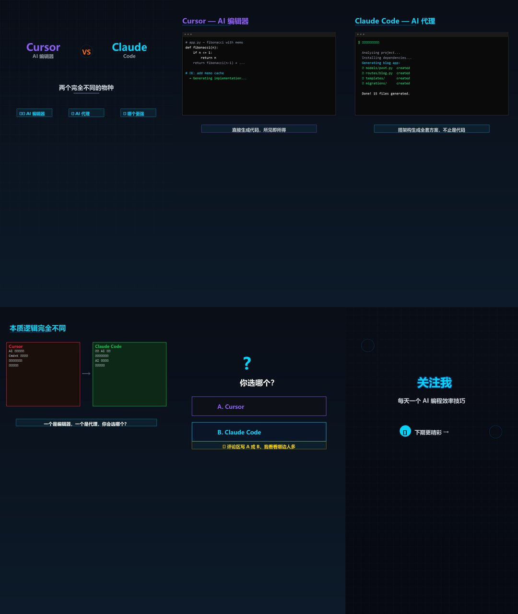

# clipgen — Short Video Auto Generator / 短视频自动生成器

> AI 配音 + 字幕 + 画面，一键生成短视频 / AI-powered short video generator with TTS, subtitles and visuals.  
> **No API key required. Completely free.** / **不需要 API Key，完全免费。**

```bash
pip install clipgen

# English
clipgen quick "Hey guys" "Today I want to share a tool" "Follow me"

# 中文
clipgen quick "大家好" "今天介绍一个好用的工具" "关注我"
```

<p align="center">
  
</p>

---

## Quick Start / 快速上手

### One-liner / 一句话命令

```bash
clipgen quick "script 1" "script 2" "script 3"
```
Auto-detects English or Chinese. First line → title, middle → content, last → CTA.  
自动检测中英文，无需任何配置。

### Interactive wizard / 交互式向导

```bash
clipgen wizard
```
Step by step input. Best for beginners. / 一步步输入，适合小白。

### Modify & regenerate / 不满意就修改

```bash
clipgen refine
```
Edit scenes, change templates, tweak colors, re-generate. All interactive.  
修改文案、换模板、调颜色，改完重新生成。

### Advanced / 进阶

```bash
clipgen build my_video.yaml        # 从 YAML 配置文件生成
clipgen templates                   # 查看模板列表
clipgen --help                      # 完整帮助
```

---

## Features / 功能

1. **6 visual templates** / 6 套画面模板 — title, comparison, terminal, code_diff, question, cta
2. **AI TTS voiceover** / AI 配音 — Edge-TTS, supports Chinese & English, **free** / **免费**
3. **Auto subtitle generation** / 自动字幕 — SRT with proper timing
4. **FFmpeg video composition** / FFmpeg 合成 — 1080×1920 portrait MP4

## Built-in Templates / 内置模板

| Template | Description |
|----------|-------------|
| `title` | Title card with grid background & tags / 标题卡 |
| `comparison` | Split-screen VS comparison / 分屏对比 |
| `terminal` | Terminal window with command output / 终端演示 |
| `code_diff` | Before/After code diff / 代码对比 |
| `question` | A/B voting card / 投票互动 |
| `cta` | Call-to-action follow prompt / 关注引导 |

## Custom Templates / 定制模板

A template is a `(draw: ImageDraw, scene: dict)` function:

```python
from clipgen.utils import *
from clipgen.engine import register_template

def render(draw, scene):
    gradient_bg(draw)
    draw.text((100, 500), scene.get("text"), fill=hex_rgb("#fff"), font=F(36))

register_template("my_template", render)
```

Then use it with `template: my_template` in your config.

## Dependencies / 依赖

- Python ≥ 3.10
- Pillow, PyYAML, edge-tts, imageio-ffmpeg
- **No API key needed. Zero cost. / 不需要任何 API Key，完全免费**

## License

MIT
